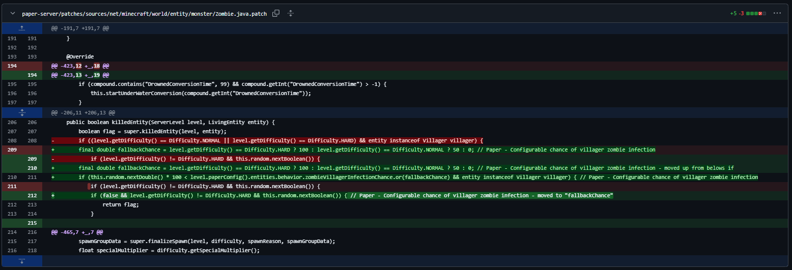
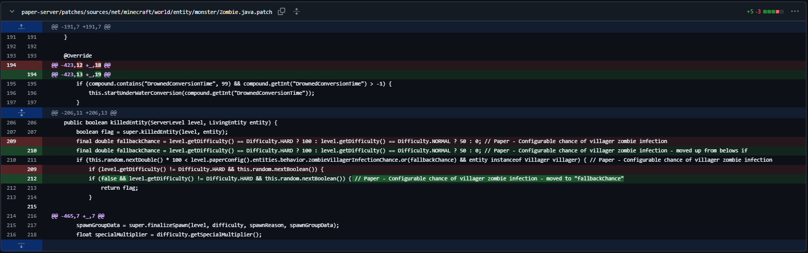

# GitHubDiffUtil
An Util Extension for working with GitHub diffs

## Easily read diff on .patch files
press Ctrl+Shift+F to apply

Example for https://github.com/PaperMC/Paper/commit/eeec611b9d16cb93ce720a7ab8cbf87f5516d499 \
Original:\

Converted:\

> [!WARNING]
> This is nowhere near finished. I continue developing and fixing things as problems arise